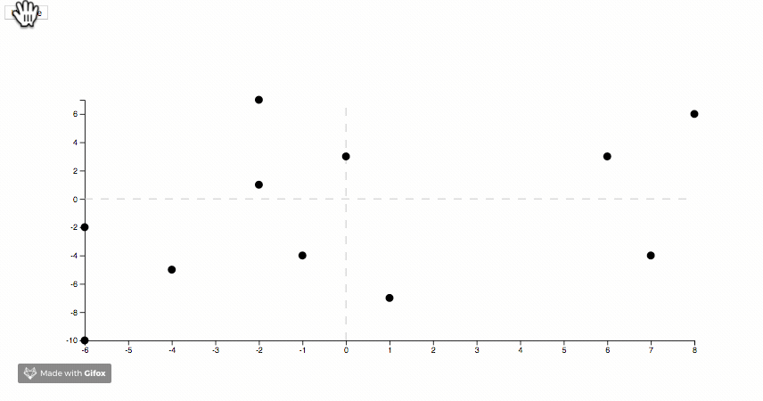

# D3 Scatter Plots

I wanted to play around with scatter plots in d3.  So here it is!

## How to run it

* Clone the repository
* `cd` into that folder
* Start a little server (e.g., `python -m SimpleHTTPServer 8000`)
* Direct your favorite web browser to http://localhost:8000

Have fun watching points zoom around!
